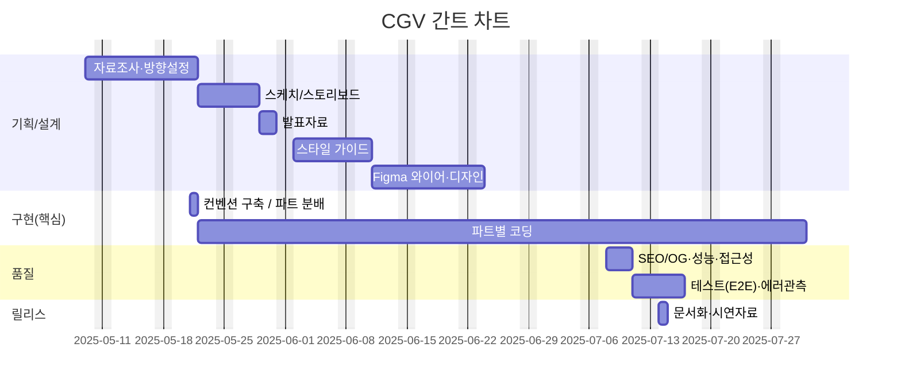

# Renewal_project_Cgv

### 과정명 : 프로젝트 기반 프론트엔드 개발자 양성
+ 기간 : 2025/03/24 ~ 2025/09/24
+ 3차 프로젝트 : 2025/08/27 ~ 2025/09/19

## 빠른 링크
+ 📑 기획서(피그마 슬라이드) : https://www.figma.com/slides/xhYQIPhYWHqIumk73Xyssf/%EC%82%BC%EB%8F%8C%EC%9D%B4%ED%8C%80-ppt?node-id=497-950&t=ydlMAr5EYNppukV7-1
+ 🎨 디자인 원본(피그마) : https://www.figma.com/design/cNWqo63kkdZgcqTbzLOIxy/%EC%82%BC%EB%8F%8C%EC%9D%B4%ED%8C%80-%EB%93%9C%EB%9E%98%ED%94%84%ED%8A%B8?node-id=151-92&t=aanZ6ST0G3ZiyQq4-1
+ 🌐 배포 URL: 

---
## 1. 프로젝트 개요
### 1.1 목표
+ 개인 작업물 전시: 프론트엔드 과정 수료 후 제작한 프로젝트와 포트폴리오를 한 곳에 모아 소개
+ 실서비스형 구현: Next.js App Router와 Supabase를 활용한 인증, 데이터 관리, 파일 업로드 기능 포함
+ 관리 효율성: 관리자 로그인 후 포트폴리오 항목 CRUD가 가능하도록 구성
+ 배포 경험: Vercel을 통한 프로덕션 배포 및 CI/CD 경험

### 1.2 👥 팀원
| 이름 | 역할 | 주요담당 | GitHub | 연락 |
| --- | --- | --- | --- | --- |
| 박경선 | 팀장 · 기획/퍼블리싱/개발/디자인  | 프로젝트 기획, 메인 페이지, 로그인 페이지,회원가입 페이지 제작 | @Ha-im |  |
| 김영태 | 기획/퍼블리싱/개발/디자인 | 프로젝트 기획, 메인 페이지, 영화 상세 페이지 제작 | @kyt0830 |  |
| 박연미 | 기획/퍼블리싱/개발/디자인 | 프로젝트 기획, 메인 페이지, 티켓 예매 페이지 제작 | @yeonmi0818 | parkyunme@naver.com |

---
## 2. 개발 환경
### 2.1 기술 스택
+ **Language**: HTML, CSS, JavaScript, Jquery
+ **Design Tool**: Figma
+ **Version Control**: Git & GitHub
+ **Deployment**: GitHub Pages

---
## 3. 주요기능
+ **메인 페이지**
	+ 비주얼(메인 배너)
	+ 영화 랭킹
	+ 상영 예정작
	+ 영화 추천
	+ 특별 상영관 페이지
	+ 스토어 영역
	+ 극장찾기
	+ 앱 다운로드
	+ 풋터

+ **서브페이지**
	+ 로그인/회원가입 페이지
	+ 영화 정보 페이지
	+ 영화 예매 페이지

+ **UI/UX 요소**
	+ 반응형 화면
	+ 컨포넌트 애니메이션
	+ 이미지 슬라이드

---
## 4. 폴더 구조
```
Renewal_project_Cgv/<br>
├─ common.html             			# 메인 페이지
├─ index.html             			# 메인 페이지
├─ login.html             			# 로그인 페이지
├─ movies_intro.html        		# 베너
├─ movies.html              		# 뉴스·이벤트
├─ policy.html            			# 정책
├─ reservation_confirm.html 		# 예매 완료 페이지
├─ signup.html            			# 회원가입 페이지
├─ ticket_seat.html        			# 좌석선택 페이지
├─ ticket.html            			# 티켓예매 페이지
├─ css/
│  ├─ reset.css
│  ├─ commmon.css
│  ├─ main.css
│  ├─ header.css
│  ├─ footer.css
│  ├─ login.css
│  ├─ signup.css
│  ├─ movies_intro.css
│  ├─ movies.css
│  ├─ ticket.css
│  ├─ ticket_seat.css
│  └─ reservation_confirm.css
├─ js/
│  ├─ common.js
│  ├─ main.js
│  ├─ login.js
│  ├─ signup.js
│  ├─ ticket.js
│  ├─ ticket_seat.js
│  └─ reservation_confirm.js
├─ js/
│  ├─ rankd.json
│  ├─ recommend.json
│  ├─ login.json
│  ├─ slides.json
│  └─ ticket.json
├─ images/
│  ├─ cinema/
│  ├─ event_zone/
│  ├─ login/
│  ├─ mousecursor/
│  ├─ plan/
│  ├─ popup/
│  └─ ...
└─ README.md
```
---
## 5. 실행 방법
```bash
### 1. 프로젝트 클론
git clone https://github.com/yeonmi0818/Renewal_project_Cgv.git

### 2. 프로젝트 폴더로 이동
cd Renewal_project_Cgv

### 3. index.html을 브라우저로 열기
```
※ 로컬 서버에서 실행하려면 VS Code의 Live Server 확장 등을 사용하면 편리합니다.

---
## 6. 향후 개선 사항
+ CSS 변수/SCSS 적용으로 유지보수성 강화
+ JavaScript 모듈화 및 코드 최적화
+ 접근성(A11y) 개선
+ 이미지 최적화로 로딩 속도 향상

---
## 7. 미리 보기


---
## 8. 🗓️마일스톤



---